# Grover's Search Algorithm

### Inputs

You are given the number of bits in the function input $n$ and the phase oracle for the problem we're solving - a "black box" quantum operation $U_f$ that implements a classical function $f(x)$. 

As usual, the phase oracle $U_f$ is defined by its effect on the individual values $x$ (represented as basis states $\ket{x}$). 
If the value of the function on the input $x$ $f(x) = 1$, the corresponding basis state $\ket{x}$ is multiplied by $-1$; otherwise, the basis state is not changed.
Formally, this can be written as follows:

$$U_f \ket{x} = (-1)^{f(x)} \ket{x}$$

> Typically the oracle for Grover's search is implemented as a marking oracle and then converted into a phase oracle using the phase kickback trick.

### Algorithm outline

The high-level outline of the algorithm is very simple:

1. Initialize the quantum system to a well-known starting state.
2. Apply a fixed sequence of "Grover iterations" several times. Each iteration is implemented as pair of operations that includes one call of the oracle "black box".
3. Finally, measuring all qubits will produce the desired output with high probability.

Let's take a closer look at the algorithm.

> We will use a convenient visualization of the algorithm steps rather than mathematical derivation.
> They are equivalent, but the visual representation is much easier to follow.

### Initial state and definitions

Grover's search algorithm begins with a uniform superposition of all the states in the search space.
Typically, the search space is defined as all $n$-bit bit strings, so this superposition is just an even superposition 
of all $N = 2^n$ basis states on $n$ qubits:
$$\ket{\text{all}} = \frac{1}{\sqrt{N}}\sum_{x=0}^{N-1}{\ket{x}} $$

When this superposition is considered in the context of the equation $f(x) = 1$, 
all the basis states can be split in two groups:  "good" (solutions) and "bad" (non-solutions).
If the number of states for which $f(x)=1$ (the number of equation solutions) is $M$, 
two uniform superpositions of "good" and "bad" states can be defined as follows:

$$\ket{\text{good}} = \frac{1}{\sqrt{M}}\sum_{x,f(x)=1}{\ket{x}}$$
$$\ket{\text{bad}} = \frac{1}{\sqrt{N-M}}\sum_{x,f(x)=0}{\ket{x}}$$

Now, the even superposition of all basis states can be rewritten as follows:
$$\ket{\text{all}} = \sqrt{\frac{M}{N}}\ket{\text{good}} + \sqrt{\frac{N-M}{N}}\ket{\text{bad}}$$

The amplutudes $\sqrt{\frac{M}{N}}$ and $\sqrt{\frac{N-M}{N}}$ can then be written in a trigonometric representation,
as a sine and cosine of the angle $\theta$:

$$\sin \theta = \sqrt{\frac{M}{N}}, \cos \theta = \sqrt{\frac{N-M}{N}}$$

With this replacement, the initial state can be written as 

$$\ket{\text{all}} = \sin \theta \ket{\text{good}} + \cos \theta \ket{\text{bad}}$$

The states involved in the algorithm can be represented on a plane on which $\ket{\text{good}}$ and $\ket{\text{bad}}$ vectors correspond to vertical and horizontal axes, respectively.

### Grover's iteration

Each Grover's iteration consists of two operations.

1. The phase oracle $U_f$.
2. An operation called "reflection about the mean".

Applying the phase oracle to the state will flip the sign of all basis states in $\ket{\text{good}}$ 
and leave all basis states in $\ket{\text{bad}}$ unchanged:

$$U_f\ket{\text{good}} = -\ket{\text{good}}$$
$$U_f\ket{\text{bad}} = \ket{\text{bad}}$$

On the circle plot, this transformation leaves the horizontal component of the state vector unchanged and reverses its vertical component. In other words, this operation is a reflection along the horizontal axis.

"Reflection about the mean" is an operation for which the visual definition is much more intuitive than the mathematical one.
It is literally a reflection about the state $\ket{\text{all}}$ - the uniform superposition of all basis states in the search space. 

Mathematically, this operation is described as $2\ket{\text{all}}\bra{\text{all}} - I$: it leaves the component of the input state parallel to the state $\ket{\text{all}}$ unchanged and multiplies the component orthogonal to it by $-1$.

As we can see, the pair of these reflections combined amount to a counterclockwise rotation by an angle $2\theta$. 
If we repeat the Grover's iteration, reflecting the new state first along the horizontal axis and then along the $\ket{\text{all}}$ vector, it performs a rotation by $2\theta$ again. The angle of this rotation depends only on the angle between the reflection axes and not on the state we reflect!

Each iteration of Grover's search adds $2\theta$ to the current angle in the expression of the system state as a superposition of $\ket{\text{good}}$ and $\ket{\text{bad}}$.
After applying $R$ iterations of Grover's search the state of the system will become

$$\sin{(2R+1)\theta}\ket{\text{good}} + \cos{(2R+1)\theta}\ket{\text{bad}}$$

At first, each iteration brings the state of the system closer to the vertical axis, increasing the probability of measuring one of the basis states that are part of $\ket{\text{good}}$ - the states that are solutions to the problem.
