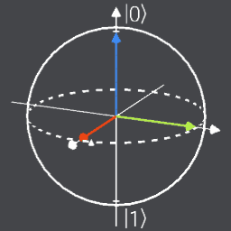
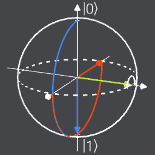
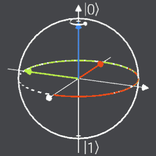
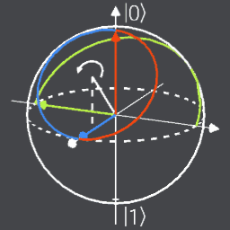
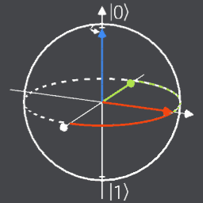
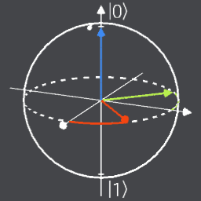
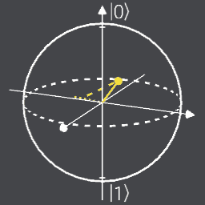

# qbit，Q#量子算法练习库

## 量子门电路、酉矩阵及示意图
|门名称|电路|酉矩阵|示意图|
|---|---|---|---|
|Pauli-X (X)|$-\boxed{X}-$|$$\begin{bmatrix} 0 & 1 \\ 1 & 0 \end{bmatrix}$$||
|Pauli-Y (Y)|$-\boxed{Y}-$|$$\begin{bmatrix} 0 & -i \\ i & 0 \end{bmatrix}$$||
|Pauli-Z (Z)|$-\boxed{Z}-$|$$\begin{bmatrix} 1 & 0 \\ 0 & 1 \end{bmatrix}$$||
|Hadamard (H)|$-\boxed{H}-$|$$ \frac{1}{\sqrt{2}}\begin{bmatrix} 1 & 1 \\ 1 & -1 \end{bmatrix} $$||
|Phase (S, P)|$-\boxed{S}- $|$$\begin{bmatrix} 1 & 0 \\ 0 & i \end{bmatrix}$$||
|$\pi/8$ (T)|$-\boxed{T}- $|$$\begin{bmatrix} 1 & 0 \\ 0 & e^{i\pi/4} \end{bmatrix}$$||
|Measure||||
|Controlled Not (CNOT, CX)||$$ \begin{bmatrix} I & 0 \\ 0 & X \end{bmatrix}$$|
|Controlled Z (CZ)||$$ \begin{bmatrix} I & 0 \\ 0 & Z \end{bmatrix}$$||
|SWAP||$$\begin{bmatrix} 1 & 0 & 0 & 0 \\ 0 & 0 & 1 & 0 \\ 0 & 1 & 0 & 0 \\ 0 & 0 & 0 & 1 \end{bmatrix}$$||
|Toffoli (CCNOT, CCX, TOFF)||$$\begin{bmatrix} I & 0 & 0 & 0 \\ 0 & I & 0 & 0 \\ 0 & 0 & I & 0 \\ 0 & 0 & 0 & X \end{bmatrix}$$||

## 创建双量子纠缠：贝尔态（Bell's State/EPR Pairs）
首先准备两个量子比特$|0\rangle|0\rangle$，然后对第一个量子比特执行H门得到$|+\rangle|0\rangle$，再对两个量子比特执行CNOT门，最后得到贝尔态$\frac{1}{\sqrt{2}}(|00\rangle + |11\rangle)$。矩阵表示为：

1. 准备两个量子比特$\begin{bmatrix} 1 \\ 0 \end{bmatrix}$，$\begin{bmatrix} 1 \\ 0 \end{bmatrix}$

2. 对第一个量子比特执行H门：$$ \frac{1}{\sqrt{2}}\begin{bmatrix} 1 & 1 \\ 1 & -1 \end{bmatrix} \begin{bmatrix} 1 \\ 0 \end{bmatrix}=\frac{1}{\sqrt{2}}\begin{bmatrix} 1 \\ 1 \end{bmatrix} $$

3. 对两个量子比特执行CNOT门：$$\begin{bmatrix} I & 0 \\ 0 & X \end{bmatrix} \left(\frac{1}{\sqrt{2}}\begin{bmatrix} 1 \\ 1 \end{bmatrix} \otimes \begin{bmatrix} 1 \\ 0 \end{bmatrix}\right) = \frac{1}{\sqrt{2}}\begin{bmatrix} 1 \\ 0 \\ 0 \\ 1 \end{bmatrix}$$

## 量子相位反冲（Phase Kickback）
首先准备两个量子比特$|0\rangle|0\rangle$，然后对第一个量子比特执行H门，第二个量子比特执行H、Z门得到$|+\rangle|-\rangle$，再对两个量子比特执行CNOT门，就可以将处在X门的本征态的第二个量子比特（目标比特）的本征值（-1这个相位因子）反冲回第一个量子比特（控制比特），使其相位翻转，最后得到$|-\rangle|-\rangle$。矩阵表示为：

$$\begin{bmatrix} I & 0 \\ 0 & X \end{bmatrix} \left(\frac{1}{2}\begin{bmatrix} 1 \\ 1 \end{bmatrix} \otimes \begin{bmatrix} 1 \\ -1 \end{bmatrix}\right) = \frac{1}{2}\begin{bmatrix} 1 \\ -1 \\ -1 \\ 1 \end{bmatrix} = \frac{1}{2} \begin{pmatrix} 1 \times \begin{pmatrix} 1 \\ -1 \end{pmatrix} \\ -1 \times \begin{pmatrix} 1 \\ -1 \end{pmatrix} \end{pmatrix} = \frac{1}{\sqrt{2}}\begin{bmatrix} 1 \\ -1 \end{bmatrix} \otimes \frac{1}{\sqrt{2}}\begin{bmatrix} 1 \\ -1 \end{bmatrix}$$