# Grover 的搜索算法

### 输入

您将获得函数输入 $n$ 中的位数以及我们正在解决的问题的相位预言机 - 实现经典函数 $f(x)$ 的“黑匣子”量子操作 $U_f$。

像往常一样，相位预言 $U_f$ 由其对各个值 $x$（表示为基础状态 $\ket{x}$）的影响来定义。 
如果输入$x$$f(x) = 1$上的函数值，则对应的基础状态$\ket{x}$乘以$-1$；否则，基本状态不会改变。
形式上，可以写成如下：

$$U_f \ket{x} = (-1)^{f(x)} \ket{x}$$

> 通常，格罗弗搜索的预言机被实现为标记预言机，然后使用阶段反冲技巧转换为相位预言机。

### 算法概要

该算法的高级概要非常简单：

1. 将量子系统初始化到已知的起始状态。
2. 多次应用固定序列的“Grover 迭代”。每次迭代都作为一对操作来实现，其中包括对预言机“黑匣子”的一次调用。
3. 最后，测量所有量子位将很有可能产生所需的输出。

让我们仔细看看该算法。

> 我们将使用算法步骤的方便可视化而不是数学推导。
> 它们是等效的，但视觉表示更容易理解。

### 初始状态和定义

Grover 的搜索算法从搜索空间中所有状态的均匀叠加开始。
通常，搜索空间被定义为所有$n$位的位串，因此这种叠加只是偶叠加 
$n$ 量子位上的所有 $N = 2^n$ 基础状态：
$$\ket{\text{all}} = \frac{1}{\sqrt{N}}\sum_{x=0}^{N-1}{\ket{x}} $$

当在方程 $f(x) = 1$ 的上下文中考虑这种叠加时， 
所有基础状态都可以分为两组：“好”（解决方案）和“坏”（非解决方案）。
如果$f(x)=1$（方程解的数量）的状态数量为$M$， 
“好”和“坏”状态的两个统一叠加可以定义如下：

$$\ket{\text{good}} = \frac{1}{\sqrt{M}}\sum_{x,f(x)=1}{\ket{x}}$$
$$\ket{\text{bad}} = \frac{1}{\sqrt{N-M}}\sum_{x,f(x)=0}{\ket{x}}$$

现在，所有基态的偶叠加可以重写如下：
$$\ket{\text{all}} = \sqrt{\frac{M}{N}}\ket{\text{good}} + \sqrt{\frac{N-M}{N}}\ket{\text{bad}}$$

然后幅值 $\sqrt{\frac{M}{N}}$ 和 $\sqrt{\frac{N-M}{N}}$ 可以写成三角函数表示，
作为角度 $\theta$ 的正弦和余弦：

$$\sin \theta = \sqrt{\frac{M}{N}}, \cos \theta = \sqrt{\frac{N-M}{N}}$$

通过这种替换，初始状态可以写为

$$\ket{\text{all}} = \sin \theta \ket{\text{good}} + \cos \theta \ket{\text{bad}}$$

该算法中涉及的状态可以表示在一个平面上，其中$\ket{\text{good}}$和$\ket{\text{bad}}$向量分别对应于垂直轴和水平轴。

### Grover 的迭代

每个 Grover 迭代都包含两个操作。

1. 相位预言$U_f$。
2. 称为“均值反映”的操作。

将相位预言应用于状态将翻转 $\ket{\text{good}}$ 中所有基本状态的符号 
并保持 $\ket{\text{bad}}$ 中的所有基本状态不变：

$$U_f\ket{\text{good}} = -\ket{\text{good}}$$
$$U_f\ket{\text{bad}} = \ket{\text{bad}}$$

在圆形图上，此变换使状态向量的水平分量保持不变，并反转其垂直分量。换句话说，这个操作是沿着水平轴的反射。

“关于平均值的反思”是一种视觉定义比数学定义更直观的运算。
它实际上是关于状态 $\ket{\text{all}}$ 的反映 - 搜索空间中所有基本状态的均匀叠加。

从数学上讲，此操作被描述为 $2\ket{\text{all}}\bra{\text{all}} - I$：它将与状态 $\ket{\text{all}}$ 平行的输入状态分量保持不变，并将与其正交的分量乘以 $-1$。

正如我们所看到的，这对反射组合起来相当于逆时针旋转角度 $2\theta$。 
如果我们重复 Grover 的迭代，首先沿水平轴反映新状态，然后沿 $\ket{\text{all}}$ 向量反映，它会再次执行 $2\theta$ 旋转。这个旋转的角度仅取决于反射轴之间的角度，而不取决于我们反射的状态！

Grover 搜索的每次迭代都会将 $2\theta$ 添加到系统状态表达式中的当前角度，作为 $\ket{\text{good}}$ 和 $\ket{\text{bad}}$ 的叠加。
应用 Grover 搜索的 $R$ 次迭代后，系统状态将变为

$$\sin{(2R+1)\theta}\ket{\text{good}} + \cos{(2R+1)\theta}\ket{\text{bad}}$$

首先，每次迭代都会使系统状态更接近垂直轴，从而增加测量属于 $\ket{\text{good}}$（问题解决方案的状态）一部分的基本状态之一的概率。
