# 最佳迭代次数

Grover 搜索算法中使用的最佳迭代次数通常定义为迭代次数 
之后，算法的成功概率（测量“良好”状态之一的概率）最大化。

从几何角度来说，这意味着状态向量应该旋转到尽可能接近垂直轴。
从数学上讲，这意味着最大化状态 $\ket{\text{good}}$ 的幅度 $\sin{(2R+1)\theta}$ 
叠加中。
无论哪种定义，目标都是在 $R$ 旋转之后获得描述系统的角度 $(2R+1)\theta$
尽可能接近 $\frac{\pi}{2}$：

$$(2R+1)\theta \approx \frac{\pi}{2}$$



现在，回想一下 $\theta = \arcsin \sqrt{\frac{M}{N}}$。当$M$远小于$N$时，$\frac{M}{N}$接近0，$\theta$是一个小角度，可以近似为$\theta \approx \sqrt{\frac{M}{N}}$。这给出了 $R_{opt}$ 的以下等式

$$ 2R_{opt}+1 \approx \frac{\pi}{2\theta} = \frac{\pi}{2}\sqrt{\frac{N}{M}}$$
由于 $\theta$ 很小，$R_{opt}$ 很大，$2R_{opt}$ 旁边的 $+1$ 项可以忽略，给出最终公式：
$$ R_{opt} \approx \frac{\pi}{4}\sqrt{\frac{N}{M}}$$

如果您使用的迭代次数多于最佳迭代次数，会发生什么情况？每次迭代都会逆时针旋转状态$2\theta$，
使其远离垂直轴，从而降低测量正确答案的概率。

在此演示中，您将看到 Grover 算法在使用不同迭代次数时成功概率如何变化
在最终测量之前。

来源：GroversSearchAlgorithmDemo.qs

```qsharp
namespace Kata {
    import Std.Convert.*;
    import Std.Diagnostics.*;
    import Std.Math.*;

    @EntryPoint()
    operation GroversSearchAlgorithmDemo() : Unit {
        // Experiment with the parameters to explore algorithm behavior in different conditions!
        let n = 3;
        let prefix = [false, true, false];
        let markingOracle = Oracle_StartsWith(_, _, prefix);
        for iterations in 0..9 {
            mutable success = 0;
            for _ in 1..100 {
                let res = GroversSearch(n, markingOracle, iterations);
                if BoolArrayAsInt(prefix) == BoolArrayAsInt(res) {
                    set success += 1;
                }
            }
            Message($"{iterations} iterations - {success}% success rate");
        }
    }

    operation GroversSearch(
        n : Int,
        markingOracle : (Qubit[], Qubit) => Unit is Adj + Ctl,
        iterations : Int
    ) : Bool[] {
        use qs = Qubit[n];

        // Operation that prepares the state |all⟩.
        let meanStatePrep = ApplyToEachCA(H, _);

        // The phase oracle.
        let phaseOracle = ApplyMarkingOracleAsPhaseOracle(markingOracle, _);

        // Prepare the system in the state |all⟩.
        meanStatePrep(qs);

        // Do Grover's iterations.
        for _ in 1..iterations {
            // Apply the phase oracle.
            phaseOracle(qs);

            // Apply "reflection about the mean".
            ReflectionAboutState(qs, meanStatePrep);
        }

        // Measure to get the result.
        return ResultArrayAsBoolArray(MResetEachZ(qs));
    }

    operation Oracle_StartsWith(x : Qubit[], y : Qubit, p : Bool[]) : Unit is Adj + Ctl {
        ApplyControlledOnBitString(p, X, x[...Length(p) - 1], y);
    }

    operation ApplyMarkingOracleAsPhaseOracle(
        markingOracle : (Qubit[], Qubit) => Unit is Adj + Ctl,
        qubits : Qubit[]
    ) : Unit is Adj + Ctl {
        use minus = Qubit();
        within {
            X(minus);
            H(minus);
        } apply {
            markingOracle(qubits, minus);
        }
    }

    operation ReflectionAboutState(
        qs : Qubit[],
        statePrep : Qubit[] => Unit is Adj + Ctl
    ) : Unit is Adj + Ctl {
        within {
            Adjoint statePrep(qs);
        } apply {
            ConditionalPhaseFlip(qs);
        }
    }

    operation ConditionalPhaseFlip(qs : Qubit[]) : Unit is Adj + Ctl {
        within {
            ApplyToEachA(X, qs);
        } apply {
            Controlled Z(qs[1...], qs[0]);
        }
        R(PauliI, 2.0 * PI(), qs[0]);
    }
}
```

### 验证算法输出是否正确

请注意，即使使用最佳迭代次数，也无法保证 $100\%$ 成功概率。
Grover 的搜索是一种概率算法，这意味着即使在最好的情况下它也具有非零的失败概率。
当您使用它来解决问题时，您需要在将其用于任何目的之前检查输出是否正确。

如果您能够访问问题的经典描述，则可以经典地完成此操作
（在此 kata 中使用的示例中，您将检查返回状态的前缀是否与给定的前缀匹配。）

一般来说，该算法仅获取标记预言作为输入，并且不具有有关经典问题结构的信息。 
然而，验证输出所需的所有信息都已包含在预言机本身中！  
标记预言对输入的影响（编码为量子位寄存器的基本状态）定义为
$$U_f \ket{x} \ket{y} = \ket{x} \ket{y \oplus f(x)}$$

这意味着如果将算法 $x_0$ 的返回值编码为量子位寄存器的基本状态， 
在 $\ket{0}$ 状态分配一个额外的量子位，并将预言 $U_f$ 应用于这些量子位，你会得到
$$U_f \ket{x} \ket{0} = \ket{x} \ket{f(x)}$$

如果您现在测量最后一个量子位，您将准确地得到 $f(x)$：如果它是 1，则算法会产生正确的答案，否则不会。如果算法失败，您可以从头开始重新运行它，并希望在下一次尝试时得到正确的答案！

### 特殊情况

最佳迭代次数的计算是在 $M$ 远小于 $N$ 但大于 $0$ 的假设下完成的。换句话说，如果搜索问题的解决方案存在，但数量很少，则该算法有效。

如果这些假设无效会发生什么？

#### 无解决方案 ($M = 0$)

在本例中，启动系统状态为 $\ket{\psi} = \ket{\text{bad}}$ 和 $\theta = \arcsin \sqrt{\frac{M}{N}} = 0$。
无论我们进行多少次迭代，我们的测量产生标记状态的概率都是 $0$。

实际上，这意味着格罗弗的搜索每次都会产生随机的非解。 
为了检测到这种情况，我们需要多次运行该算法并记下结果。如果它们都不是问题的解决方案，我们可以得出结论，该问题没有解决方案。

#### 解决方案占据了搜索空间的一半

如果 $M = \frac{N}{2}$，则 $\theta = \arcsin \sqrt\frac{N/2}{N}  = \arcsin \sqrt\frac{1}{2} = \frac{\pi}{4}$。   
这意味着在任意次数的迭代 $R$ 后，系统中基本状态 $\ket{\text{good}}$ 的幅度将为：

$$\sin{(2R+1)\theta} = \sin\frac{(2R+1)\pi}{4} = \pm \frac{1}{\sqrt{2}}$$

测量产生解决方案的概率为 $P(\ket{\text{good}}) = \sin^2\frac{(2R+1)\theta}{2} = (\pm \frac{1}{\sqrt{2}})^2 = \frac{1}{2}$

您可以看到，无论迭代次数如何，测量作为解的状态的概率都保持不变。

#### 解决方案占搜索空间的一半以上

如果 $\frac{N}{2} < M \leq N$，则 $\frac{\pi}{4} < \theta \leq \frac{\pi}{4}$。 
现在，即使使用一次迭代也并不总是会增加 $P(\ket{\text{good}}) = \sin^2{(2R+1)\theta}$。
事实上，第一次迭代很可能会降低成功的概率！

> 您是否想过为什么所有有关 Grover 搜索的教程都以两位函数开头？ 
> 这就是原因：如果只有一位，则只有 $M=0$、$M=\frac{N}{2}$ 或 $M=N$ 的函数，而这些都不能很好地说明算法！

最后两种情况更容易以经典方式处理。 
事实上，随机选择的经典值有可能成为问题的解决方案 $p = \frac{M}{N} > \frac{1}{2}$！ 
如果我们重复随机选择变量 $k$ 次，成功的概率将增长到 $1-(1-p)^k$，因此通过增加 $k$，我们可以根据需要获得接近 $1$ 的概率。
例如，对于 $p=0.5$ 和 $k=10$，成功的概率约为 $99.9\%$。

#### 未知数量的解决方案

在实际应用中，在开始解决问题之前，您通常不知道问题有多少个解决方案。 
在这种情况下，您可以选择迭代次数作为 1 到 $\frac{\pi}{4} \sqrt{N}$ 之间的随机数， 
如果搜索在第一次运行时没有产生结果，则以不同的迭代次数重新运行它。 
由于 Grover 的算法是概率性的，因此您不需要获得确切的迭代次数即可获得正确的答案！
